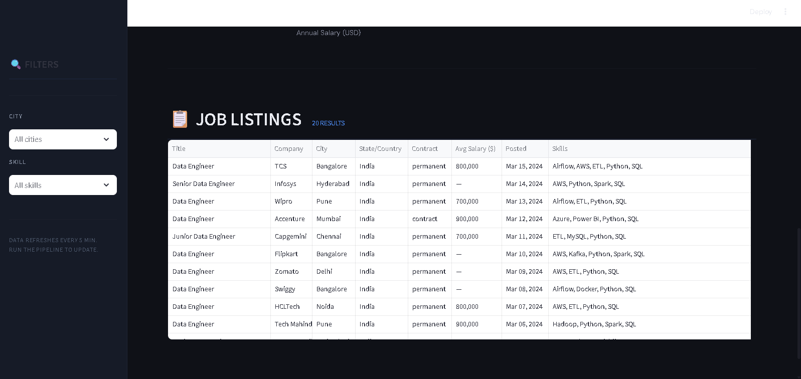
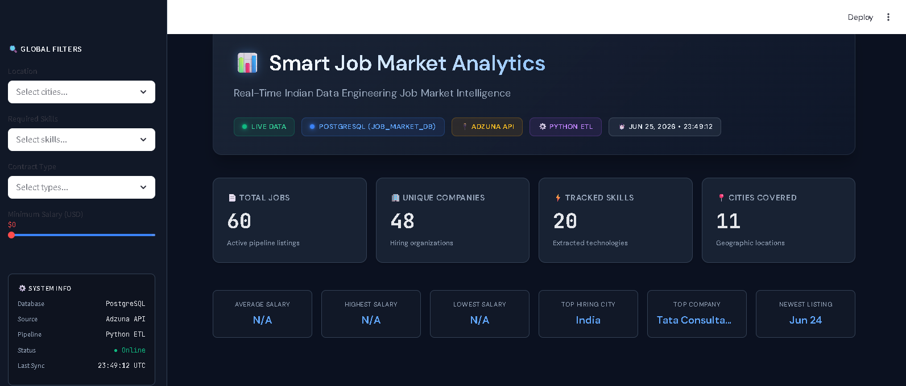

# 🚀 Smart Job Market Data Pipeline

### Real-Time Data Engineering ETL Pipeline for Indian Job Market Analytics


:::

------------------------------------------------------------------------

## 📌 Overview

**Smart Job Market Data Pipeline** is a production-style **End-to-End
ETL (Extract, Transform, Load)** project that collects real-time **Data
Engineering job listings** from the **Adzuna REST API**, cleans and
enriches the data using **Python & Pandas**, stores it in a **normalized
PostgreSQL database**, and visualizes hiring trends through an
interactive **Streamlit dashboard**.

The project demonstrates practical data engineering concepts including
API integration, ETL workflows, data cleaning, relational database
design, SQL analytics, logging, and interactive business intelligence
dashboards.

------------------------------------------------------------------------

# ✨ Features

-   🌐 Real-time job extraction from Adzuna REST API
-   🔄 Modular ETL Pipeline (Extract → Transform → Load)
-   🧹 Data cleaning, normalization and deduplication
-   🛠 Automatic skill extraction from job descriptions
-   🗄 Normalized PostgreSQL schema (3NF)
-   📊 Interactive Streamlit + Plotly dashboard
-   🔍 SQL analytics for hiring trends
-   ⚙ Configuration-driven execution using YAML
-   📝 Structured logging
-   🔁 Idempotent database loading
-   🇮🇳 Indian job market focused

------------------------------------------------------------------------

# 🏗 Architecture

``` text
                Adzuna REST API
                       │
                       ▼
        Extract (Python + Requests)
                       │
                       ▼
      Transform (Pandas + Cleaning)
                       │
                       ▼
     Clean CSV / Processed Dataset
                       │
                       ▼
     PostgreSQL (Normalized Schema)
                       │
                       ▼
     Streamlit + Plotly Dashboard
```

------------------------------------------------------------------------

# 🛠 Tech Stack

  Category          Technologies
  ----------------- ---------------------------
  Language          Python 3.13
  Data Processing   Pandas, NumPy
  API               Requests, REST API, JSON
  Database          PostgreSQL, SQL, psycopg2
  Dashboard         Streamlit, Plotly
  Configuration     YAML
  Version Control   Git, GitHub
  Logging           Python Logging

------------------------------------------------------------------------

# 📂 Project Structure

``` text
job-data-pipeline/
├── dashboard/
│   └── app.py
├── src/
│   ├── extract.py
│   ├── transform.py
│   ├── load.py
│   └── utils.py
├── sql/
│   ├── schema.sql
│   └── queries.sql
├── data/
│   ├── raw/
│   └── processed/
├── assets/
├── config.yaml
├── requirements.txt
├── main.py
└── README.md
```

------------------------------------------------------------------------

# 🚀 Getting Started

## Clone

``` bash
git clone https://github.com/Mayankgiya42/smart-job-market-data-pipeline.git
cd smart-job-market-data-pipeline
```

## Create Virtual Environment

``` bash
python -m venv .venv
.venv\Scripts\activate
```

## Install Dependencies

``` bash
pip install -r requirements.txt
```

## Configure

Update `config.yaml` with:

-   PostgreSQL credentials
-   Adzuna App ID
-   Adzuna App Key

------------------------------------------------------------------------

# ▶ Run ETL Pipeline

``` bash
python main.py
```

Run individual phases:

``` bash
python main.py --phase extract
python main.py --phase transform
python main.py --phase load
```

------------------------------------------------------------------------

# 📊 Launch Dashboard

``` bash
streamlit run dashboard/app.py
```

------------------------------------------------------------------------

# 📸 Dashboard Preview

``` md





```

------------------------------------------------------------------------

# 🗄 Database Schema

-   **jobs**
-   **skills**
-   **job_skills**

Designed using a normalized many-to-many relationship for efficient
analytics.

------------------------------------------------------------------------

# 📈 Insights

The dashboard provides:

-   Total Jobs
-   Top Hiring Companies
-   Most In-demand Skills
-   Jobs by Indian City
-   Salary Distribution
-   Searchable Job Listings

------------------------------------------------------------------------

# 💡 Engineering Highlights

-   Modular ETL architecture
-   REST API integration
-   Configuration-driven design
-   Structured logging
-   Idempotent database loading
-   SQL analytics
-   Interactive BI dashboard

------------------------------------------------------------------------

# 🔮 Future Enhancements

-   Apache Airflow orchestration
-   Docker & Docker Compose
-   Incremental loading
-   Data quality validation
-   CI/CD with GitHub Actions
-   AWS deployment

------------------------------------------------------------------------

# 👨‍💻 Author

**Mayank Giya**

-   GitHub: https://github.com/Mayankgiya42

------------------------------------------------------------------------